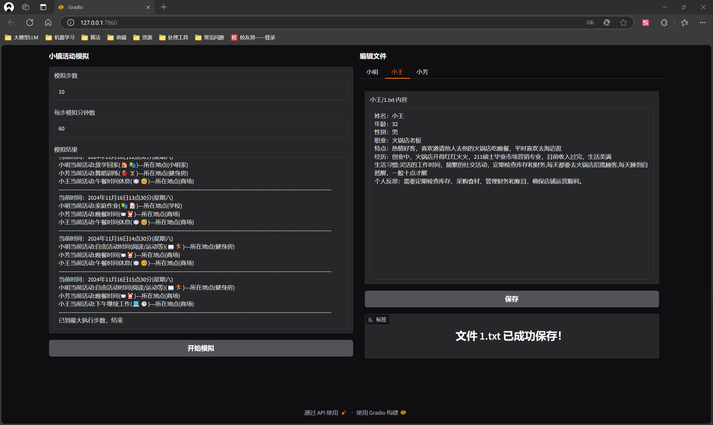
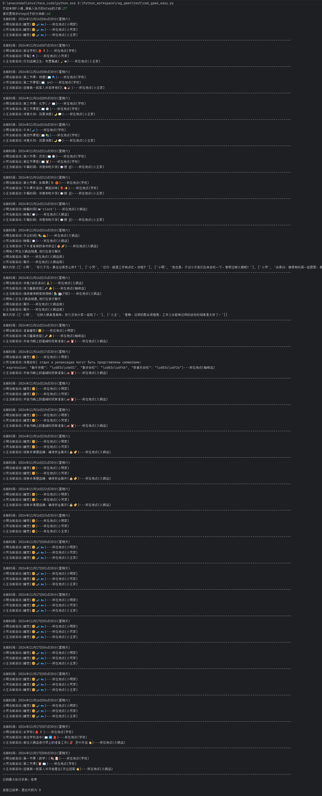
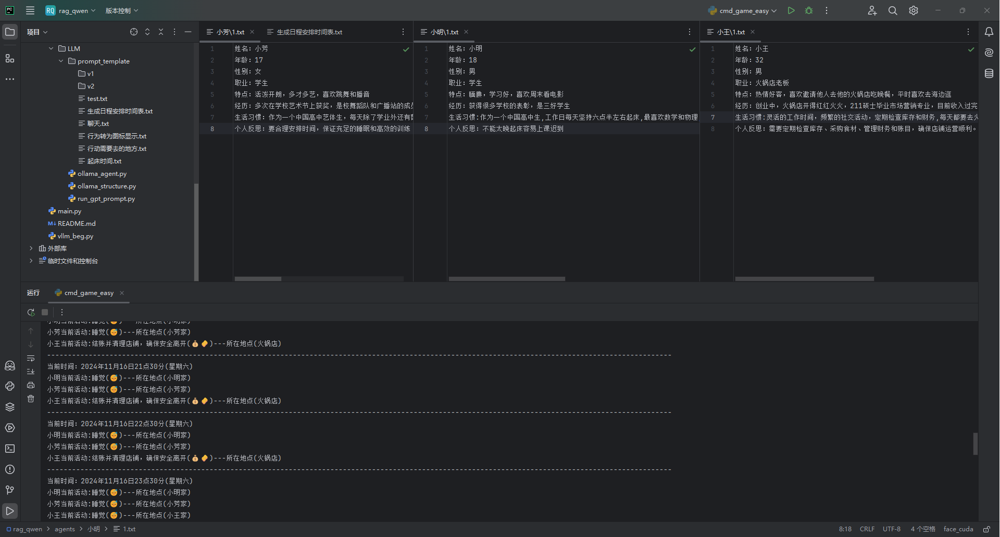
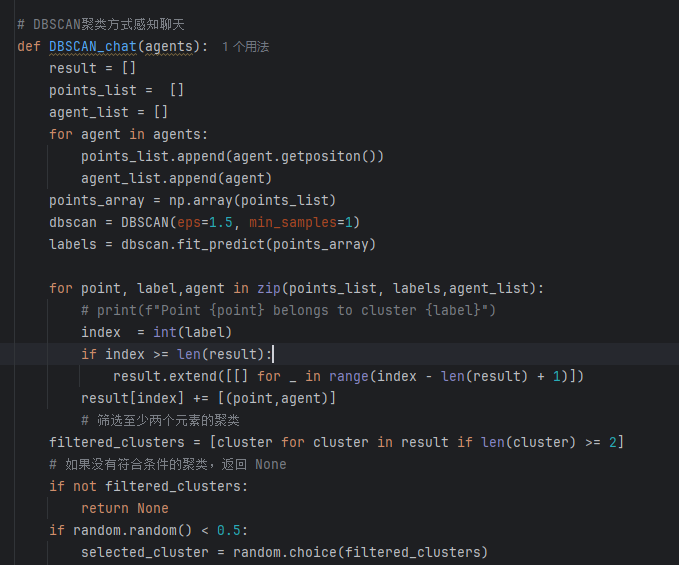
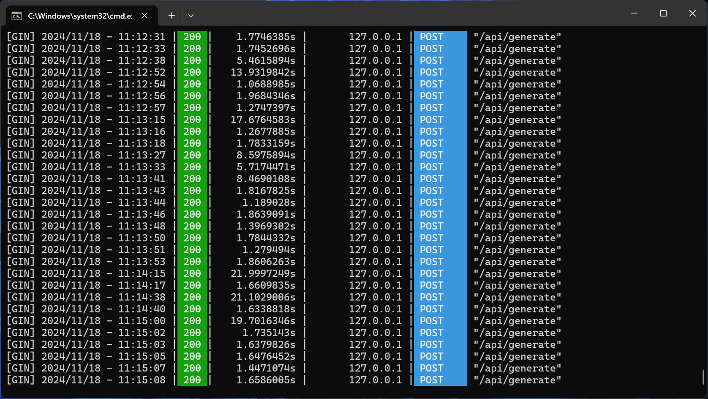
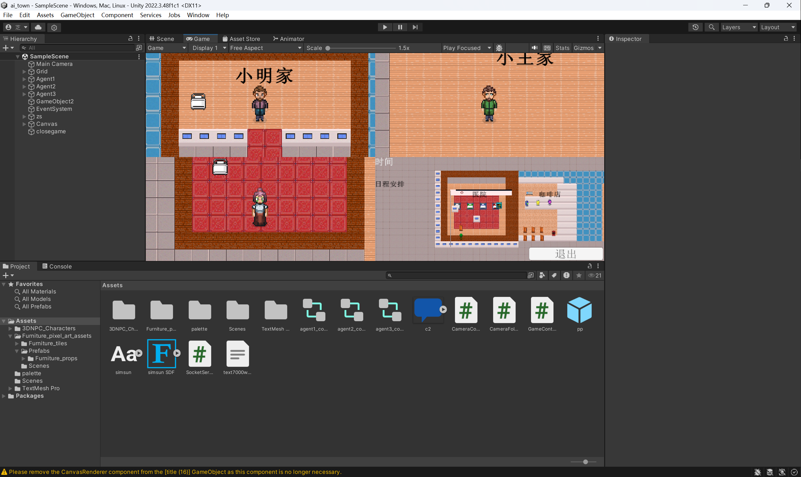

# AI中国小镇（ollama本地部署版）

## 使用方法
#### 命令行方式使用
    python cmd_game_easy.py     

#### gradio方式使用（推荐）
    python main.py    

#### 驱动unity人物行动（推荐）
    python unity_socket_main.py

##### unity脚本参考
    unity空物体挂载脚本 /readme_img/SocketServer.cs

<a href="https://github.com/xkj0127/ai_twon_unity.git">unity项目（大学生不会unity写着玩的，望海涵）</a>

<video width="640" height="360" controls>
  <source src="readme_img/unity_test.mp4" type="video/mp4">
  您的浏览器不支持 video 标签。
</video>


###  修改任务资料
直接修改agents文件夹下对应人物文件夹下1.txt文件即可

或者启动gradio页面即可修改

## 项目演示












#### vllm操作
    ```bash
    python -m vllm.entrypoints.openai.api_server --model /home/xik/models/qwen/qwen2-0___5b --port 8000 --host 172.23.161.199 --tensor-parallel-size 1
    ```

    ```python
    curl http://localhost:8000/v1/chat/completions -H "Content-Type: application/json" -d '{
    "model": "/home/xik/models/qwen/qwen2-0___5b",
    "messages": [
        {"role": "system", "content": "You are a helpful assistant."},
        {"role": "user", "content": "天空为什么是蓝色的？"}
    ],
    "temperature": 0.7,
    "top_p": 0.8,
    "repetition_penalty": 1.05,
    "max_tokens": 512
    }'
    ```

### 源代码的LLM生成函数用法
1. 得到醒来的时间  
   1. run_gpt_prompt_wake_up_hour 
   2. persona/prompt_template/v2/daily_planning_v6.txt
2. 每日计划的小时表
   1. run_gpt_prompt_generate_hourly_schedule
   2. persona/prompt_template/v2/generate_hourly_schedule_v2.txt
3. 每日任务分解(制定子任务)
   1. run_gpt_prompt_task_decomp
   2. persona/prompt_template/v2/task_decomp_v3.txt
4. 行动区域
   1. run_gpt_prompt_action_sector
   2. persona/prompt_template/v1/action_location_sector_v1.txt
5. 因为活动待的地方
   1. run_gpt_prompt_action_arena
   2. persona/prompt_template/v1/action_location_object_vMar11.txt
6. 把活动的描述转为图标
   1. run_gpt_prompt_pronunciatio
   2. persona/prompt_template/v3_ChatGPT/generate_pronunciatio_v1.txt
7. 获取活动的(主,谓,宾)
   1. run_gpt_prompt_event_triple
   2. persona/prompt_template/v2/generate_event_triple_v1.txt
8. 获取某人正在使用的对象的状态的描述
   1. run_gpt_prompt_act_obj_desc
   2. persona/prompt_template/v3_ChatGPT/generate_obj_event_v1.txt
9. 获取物体正在被使用的状态
   1. run_gpt_prompt_act_obj_event_triple
   2. persona/prompt_template/v2/generate_event_triple_v1.txt
10. 新的工作计划小时表
    1. run_gpt_prompt_new_decomp_schedule
    2. persona/prompt_template/v2/new_decomp_schedule_v1.txt
11. 任务抉择
    1. run_gpt_prompt_decide_to_talk
    2. persona/prompt_template/v2/decide_to_talk_v2.txt
12. 任务需要的资源被占用需要决策做出判断修改计划
    1. run_gpt_prompt_decide_to_react
    2. persona/prompt_template/v2/decide_to_react_v1.txt
13. 创建多人的讨论
    1.  run_gpt_prompt_create_conversation
    2. persona/prompt_template/v2/create_conversation_v2.txt
14. 总结对话变成记忆
    1.  run_gpt_prompt_summarize_conversation
    2. persona/prompt_template/v3_ChatGPT/summarize_conversation_v1.txt
15. 对谈话和事件的感情与事实的关键词提取
    1. run_gpt_prompt_extract_keywords
    2. persona/prompt_template/v2/get_keywords_v1.txt
16. 关键词这件事情想法的评价
    1. run_gpt_prompt_keyword_to_thoughts
    2. persona/prompt_template/v2/keyword_to_thoughts_v1.txt
17. 谈话的总结为记忆
    1. run_gpt_prompt_convo_to_thoughts
    2. persona/prompt_template/v2/convo_to_thoughts_v1.txt
18. 对事件的打分
    1. run_gpt_prompt_event_poignancy
    2. persona/prompt_template/v3_ChatGPT/poignancy_event_v1.txt
19. 对想法打分
    1. run_gpt_prompt_thought_poignancy
    2. persona/prompt_template/v3_ChatGPT/poignancy_thought_v1.txt
20. 对聊天打分
    1. run_gpt_prompt_chat_poignancy
    2. persona/prompt_template/v3_ChatGPT/poignancy_chat_v1.txt
21. 利用陈述涉及的主题得到最突出的高级问题
    1. run_gpt_prompt_focal_pt
    2. persona/prompt_template/v3_ChatGPT/generate_focal_pt_v1.txt
22. 陈述中推断出高层次的见解
    1. run_gpt_prompt_insight_and_guidance
    2. persona/prompt_template/v2/insight_and_evidence_v1.txt
23. 传话
    1. run_gpt_prompt_agent_chat_summarize_ideas
    2. persona/prompt_template/v3_ChatGPT/summarize_chat_ideas_v1.txt
24. 总结一下两个人物的关系。他们对彼此有什么感觉或了解？
    1. run_gpt_prompt_agent_chat_summarize_relationship
    2. persona/prompt_template/v3_ChatGPT/summarize_chat_relationship_v2.txt
25. 智能体的对话
    1. run_gpt_prompt_agent_chat
    2. persona/prompt_template/v3_ChatGPT/agent_chat_v1.txt
26. 总结想法
    1. run_gpt_prompt_summarize_ideas
    2. persona/prompt_template/v3_ChatGPT/summarize_ideas_v1.txt
27. 下一次反思
    1. run_gpt_prompt_generate_next_convo_line
    2. persona/prompt_template/v2/generate_next_convo_line_v1.txt
28. 把下面的想法翻译成一句耳语
    1. run_gpt_prompt_generate_whisper_inner_thought
    2. persona/prompt_template/v2/whisper_inner_thought_v1.txt
29. 记忆的反思更新
    1. run_gpt_prompt_memo_on_convo
    2. persona/prompt_template/v2/memo_on_convo_v1.txt
30. 角色1说什么，以角色12的话语结束
    1. run_gpt_generate_iterative_chat_utt
    2. persona/prompt_template/v3_ChatGPT/iterative_convo_v1.txt
